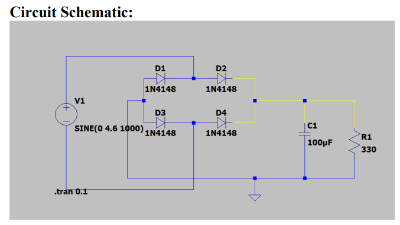
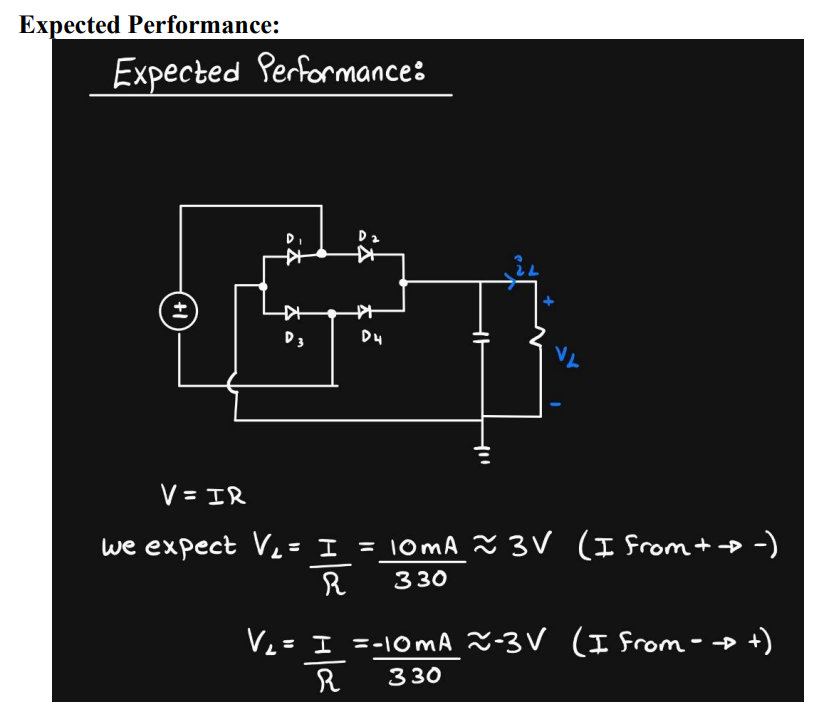
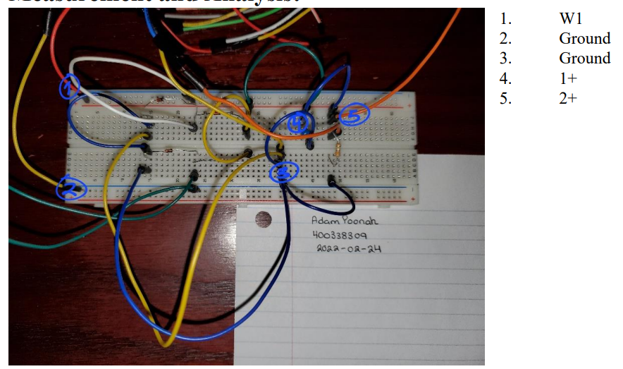
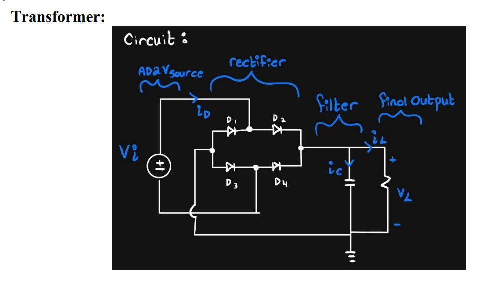

# DC Power Supply Design Project

## Table of Contents
- [Summary](#summary)
- [Design](#design)
  - [Transformer](#transformer)
  - [Rectifier](#rectifier)
  - [Filter](#filter)
  - [Regulator](#regulator)
  - [Circuit Schematic](#circuit-schematic)
  - [Calculations](#calculations)
  - [Expected Performance](#expected-performance)
  - [Design Trade-offs](#design-trade-offs)
- [Measurement and Analysis](#measurement-and-analysis)
- [Simulation](#simulation)
- [Discussion](#discussion)
- [References](#references)

## Summary
The purpose of this project is to design and build a DC power supply capable of delivering 10mA at 3V± 0.1V from a 120V source with a frequency of 1kHz. The design includes a rectifier, filter, and regulator to ensure a stable DC output.

## Design
The design of the DC power supply involves the following components:

### Transformer
Skipping the physical transformer, we use a simulated voltage source to replicate the effect of transforming 120V AC to a lower voltage level suitable for rectification.

### Rectifier
The rectifier chosen for this design is a bridge full-wave rectifier, which efficiently converts AC to DC using four diodes in a bridge configuration.

### Filter
An RC filter is employed by placing a capacitor across the load resistor, reducing voltage variations and smoothing the rectified output.

### Regulator
A regulator was not used in this design due to the acceptable output voltage range produced by the circuit.

### Circuit Schematic

### Calculations
Detailed calculations were performed to determine component values, such as the capacitor size to minimize ripple voltage.

### Expected Performance
The expected performance includes an average load voltage of approximately 3V with minimal ripple and stable current delivery.

### Design Trade-offs
This design balances efficiency and complexity, opting for a full-wave rectifier for higher efficiency at the cost of using more diodes.

## Measurement and Analysis
Measurements confirm that the design meets the required specifications with minor deviations attributed to component tolerances and practical implementation variations.

## Simulation
Simulations verify the design under ideal conditions, showing a maximum output voltage of 2.99V and a minimum of 2.95V, fitting within the expected range.

## Discussion
The results demonstrate that the designed power supply performs as expected, with slight differences between simulation and real-world measurements due to inherent circuit variations and measurement errors.

## References
1. [Difference between Half Wave and Full Wave Rectifier](https://electronicscoach.com/difference-between-half-wave-and-full-wave-rectifier.html#KeyDifferences)
2. [Center-Tapped Full-Wave Rectifier Operation](https://www.circuitbread.com/tutorials/center-tapped-full-wave-rectifier-operation)
3. [1N4148 Diode Specifications](https://abra-electronics.com/ics-semiconductors/diodes-rectifiers/switching-diodes/1n4148-diode-small-signal-fast-switching-03a-100v-1n4148.html)
